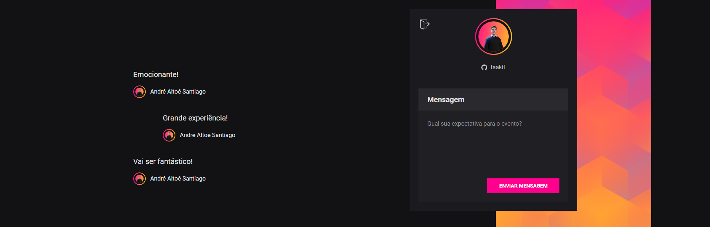

  

<h3 align="center">Por André Altoé</h3>

  

<!-- TABLE OF CONTENTS -->
<h2 id="summary"> :book: Sumário</h2>

  
Sumário

  <ol>
    <li><a href="#sobre"> ➤ Sobre</a></li>
    <li><a href="#tecnologias"> ➤ Tecnologias</a></li>
     <li><a href="#como-rodar"> ➤ Como Rodar</a></li>
    <li><a href="#creditos"> ➤ Creditos</a></li>
  </ol>

<!-- ABOUT THE PROJECT -->
<h2 id="sobre"> :pencil: Sobre</h2>

Website feito durante a NLW 06 promovida pela RocketSeat, onde foi feito tando o front-end quanto o back-end da aplicação para que usuários escrevam suas expectativas com o evento após o login social com Github.

<!-- ABOUT THE PROJECT -->
<h2 id="tecnologias"> :hammer: Tecnologias</h2>

<ul>
    <li><a href="https://www.prisma.io/" title="Prisma"></li>
    <li><a href="https://www.github.com/" title="Github"></li>
    <li><a href="https://nodejs.org/en/" title="NodeJS"></li>
    <li><a href="https://vitejs.dev/" title="ViteJS">ViteJS</a></li>
    <li></li>
    <li><a href="https://socket.io/" title="Socket.io"> Socket.io</a></li>
    <li></li>
    <li><a href="https://www.typescriptlang.org/" title="Typescript"> Typescript</a></li>
    <li><a href="https://reactjs.org/" title="React"> React Js</a></li>
    <li><a href="https://yarnpkg.com/" title="Yarn"> Yarn</a></li>
    <li><a href="https://code.visualstudio.com/" title="Visual Studio Code"> Visual Studio Code</a></li>
</ul>

<!-- ABOUT THE PROJECT -->
<h2 id="como-rodar"> :nut_and_bolt: Como Rodar</h2>

Para rodar essa aplicação localmente é necessário que você primeiro  configure uma chave para autenticação com o Github em "/backend/.env", além de uma chave para utilizar do Json Web Token.

<pre><code>GITHUB_CLIENT_SECRET
GITHUB_CLIENT_ID

JWT_SECRET</code></pre>

    Você pode rodar o projeto em ambiente de desenvolvimento simplesmente digitando os seguintes comandos em seu terminal (tanto na pasta backend quanto em frontend):

<pre><code>$ yarn
$ yarn dev</code></pre>

    O back-end estará rodando na porta <b>4000</b> e o front-end na porta <b>3000</b> por padrão.

<!-- ABOUT THE PROJECT -->
<h2 id="creditos"> :eyeglasses: Creditos</h2>

> Feito com 💙 Por André Altoé :wave:

Durante o curso Ignite da Rocketseat